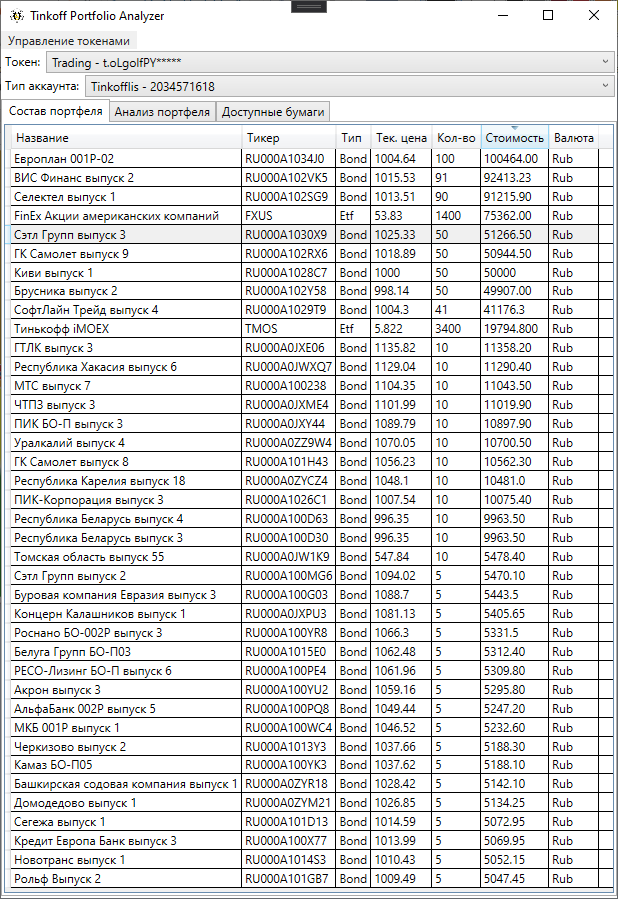
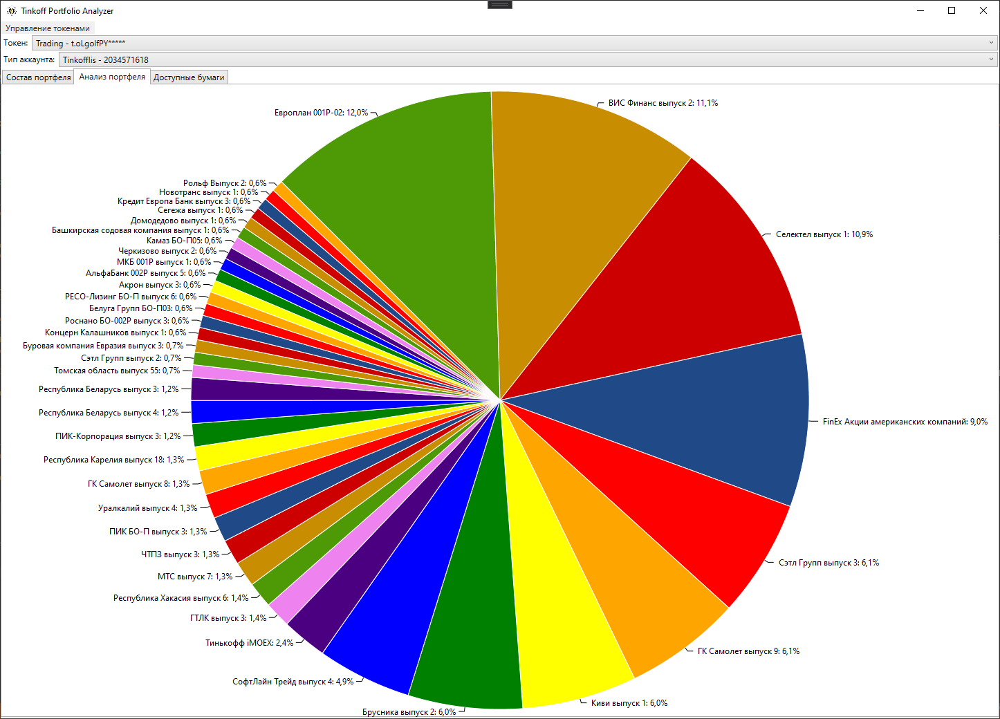
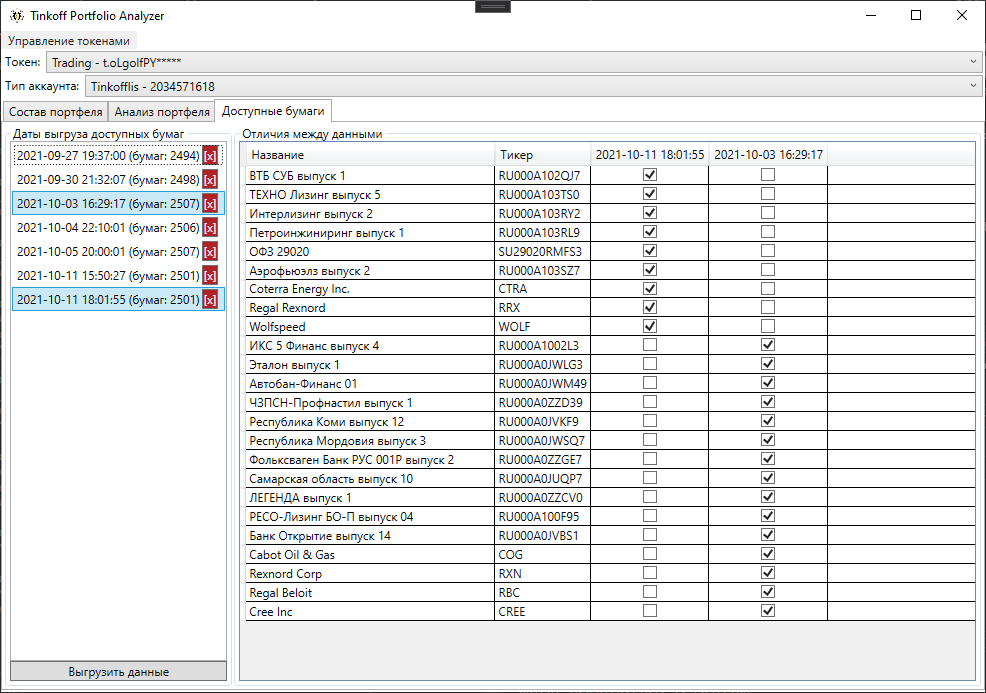

# Tinkoff Portfolio Analyzer
[](https://github.com/v0idname/TinkoffPortfolioAnalyzer/actions/workflows/build-testing.yml)

Проект для просмотра пользовательских инвест. портфелей, открытых в брокере "Тинькофф Инвестиции".

## Technologies Used
- .NET 5.0
- WPF, MVVM
- Entity Framework Core 5.0, MSSQL

## Features
- Просмотр (+ сортировка по различным параметрам) всех бумаг во всех доступных портфелях.
- Мини-анализ портфеля путем расчета % доли каждой бумаги в портфеле и их отображения в виде круговой диаграммы.
- Выгрузка всех доступных для покупки бумаг и их сохранение в БД для последующего сравнения (какие бумаги добавили / убрали).

## Usage
1. Для запуска программы выполните в консоли следующие команды:
``` 
git clone https://github.com/v0idname/TinkoffPortfolioAnalyzer <your_local_directory>
cd <your_local_directory>
dotnet build
cd TinkoffPortfolioAnalyzer
dotnet run
```
2. Для доступа к портфелям или выгрузки доступных бумаг необходимо [получить токен](https://tinkoffcreditsystems.github.io/invest-openapi/auth/). Для выгрузки списка доступных бумаг будет достаточно sandbox токена, для просмотра содержимого портфеля нужен trading токен.
3. Добавить полученный токен в программу с помощью пункта меню "Управление токенами".
4. Enjoy)

## Screenshots



